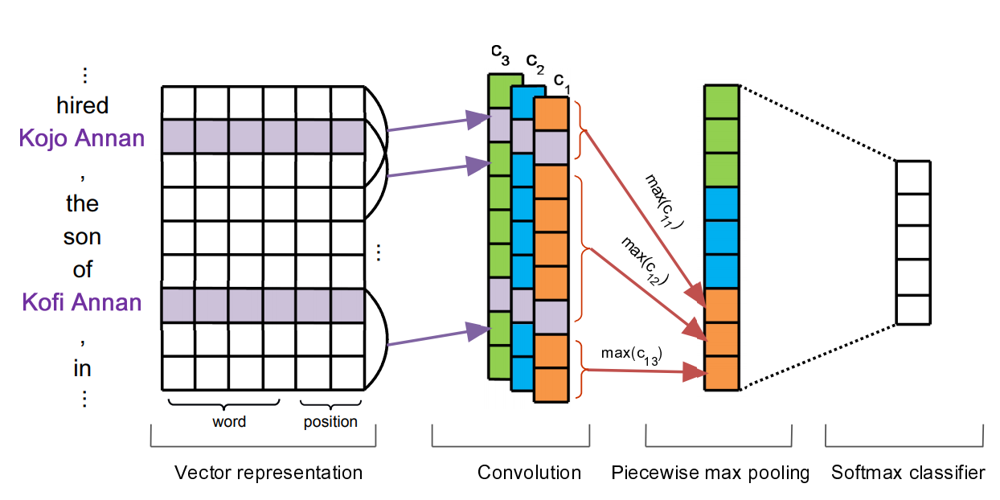
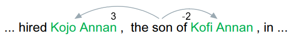
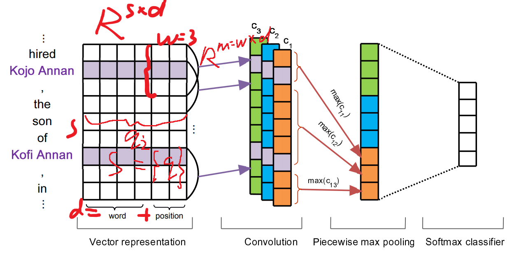
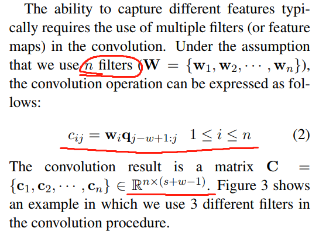
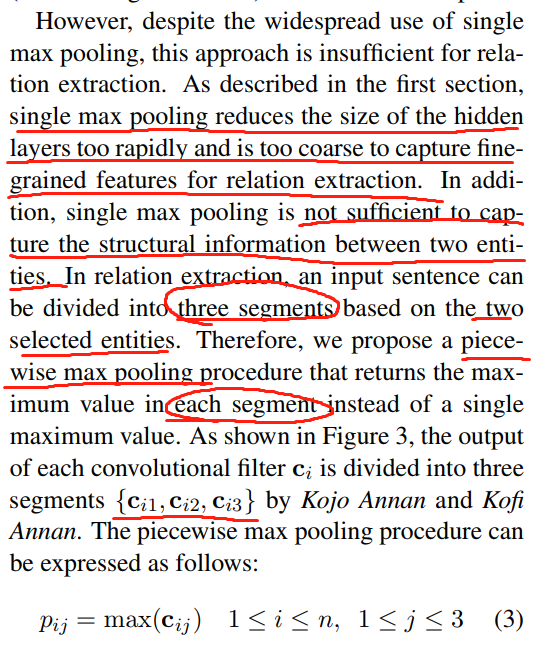
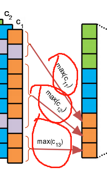

## paper profile
>- 论文名称：Distant Supervision for Relation Extraction via Piecewise Convolutional Neural Networks
>- 论文信息：Zeng et al. 2015 EMNLP
>- 模型名称：PCNN
>- 论文内容：非常经典的文章，分段式的max pooling。后面做的文章都要引用这篇文章。
>- 原文地址：http://aclweb.org/anthology/D/D15/D15-1203.pdf
___
## 1 Introduction  
>The distant supervision strategy is an effctive method of automatically labeling >trainning data. However it has two shortcomings when used for relation extraction.
>  1. the distant supervision assumption is too strong and causes wrong label problem.
>  2. previous methods have typically applied supervised models to elaborately >designed features when obtained the labeled data through distant supervision. These >errors may lead to error propagation or accumulation.  

  **太容易产生错误的标记。**
  **错误会积累会传播。**

>A sentence is inherently divided into three segments according to the two given entities. The internal context includes the characters inside
the two entities, and the external context involves the characters around the two entities (Zhang etal., 2006).

**根据被提供的两个实体，将句子分成三段。实体内部，就是实体本身包括的字符；实体外部就是其他的上下文。**

>The contributions of this paper can be summarized as follows.  
>  - We explore the feasibility of performing distant supervised relation extraction without hand-designed features. PCNNS are proposed to automatically learn features without complicated NLP preprocessing.
>  - To address the wrong label problem, we develop innovative solutions that incorporate multi-instance learning into the PCNNS for distant supervised relation extraction.
>  - In the proposed network, we devise a piecewise max pooling layer, which aims to capture structural information between two entities.

- **不使用手工创建的特征，探索远程监督关系抽取的可行性。不使用复杂NLP手段的情况下，用PCNNS来自动学习特征。**
- **为了解决错误的标签问题，开发了创新的解决方案，将多实例学习结合PCNNS，用于远程监督关系提取。**
- **设计一个*分段最大池化层*，用来捕获两个实体间的结构信息**

## 2  related work

>Performance strongly depends on the quality of the designed features, so most existing studies have concentrated on extracting features to identify the relations between two entities.

**由于效果比较依赖特征的质量，所以现在大部分研究都是关于提取特征以识别两个实体之间的关系。**

>Previous methods can be generally categorized into two types:
>  - feature-based methods
>  - kernel-based methods.

>In feature-based methods, a diverse set of strategies is exploited to convert classification clues (e.g., sequences, parse trees) into feature vectors.

**在基于特征的方法中，利用各种策略将分类线索（例如，序列，解析树）转换为特征向量。**

>Kernel-based methods provide a natural alternative to exploit rich representations of input classification clues, such as syntactic parse trees. Kernelbased methods enable the use of a large set of features without needing to extract them explicitly.

**基于内核的方法提供了一种利用输入分类线索的丰富表示的自然选择方法，例如语义树。该方法可以使用大量的特征集，不用明确的提取它们。**

>The author think NLP work is difficult to get high-quality features in the last of this section, ok, network now.
**别整着乱七八糟的啦，用神经网络自动学吧。**

## 3  methodology
>Distant supervised relation extraction is formulated as multi-instance problem. In this section, we present innovative solutions that incorporate multi-instance learning into a convolutional neural network to fulfill this task. PCNNs are proposed for the automatic learning of features without complicated NLP preprocessing. Figure 3 shows our neural network architecture for distant supervised relation extraction. It illustrates the procedure that handles one instance of a bag. This procedure includes four main parts: Vector Representation, Convolution, Piecewise Max Pooling and Softmax Output. We describe these parts in detail below.

**远程监督关系抽取为解决多例问题而制定。在本节中，我们提出了创新的解决方案，将多实例学习结合到卷积神经网络中以完成此任务。 PCNN自动学习特征而无需复杂的NLP处理。 图3显示了我们用于远程监督关系提取的神经网络架构。 它说明了处理一个包实例的过程。 此过程包括四个主要部分：向量表示，卷积，分段最大池和Softmax输出。 我们在下面详细描述这些部分。**

## 3.1  Vector Representation

>The inputs of our network are raw word tokens. When using neural networks, we typically transform word tokens into low-dimensional vectors. In our method, each input word token is transformed into a vector by looking up pre-trained word embeddings. Moreover, we use position features (PFs) to specify entity pairs, which are also transformed into vectors by looking up position embeddings.

**需要将输入的词转换成向量，并且通过嵌入的位置生成位置特征指定实体对**

### 3.1.1 Word Embeddings
>A common method of training a neural network is to randomly initialize all parameters and then optimize them using an optimization algorithm. Recent research (Erhan et al., 2010) has shown that neural networks can converge to better local minima when they are initialized with word embeddings. Word embeddings are typically learned in an entirely unsupervised manner by exploiting the co-occurrence structure of words in unlabeled text. Researchers have proposed several methods of training word embeddings (Bengio et al., 2003; Collobert et al., 2011; Mikolov et al., 2013). In this paper, we use the Skip-gram model (Mikolov et al., 2013) to train word embeddings.

**神经网络使用【词嵌入初始化】可以收敛到局部最小值。使用skip-gram模型来训练词嵌入。**

### 3.1.2  Position Embeddings
>We use PFs to specify entity pairs. A PF is defined as the combination of the relative distances from the current word to e1 and e2. For instance, in the following example, the relative distances from son to e1 (Kojo Annan) and e2 (Kofi Annan) are 3 and -2, respectively.

**用位置特征来表示实体对，PF可以定义为当前词关于相邻实体的距离的联合，如上图。**

>In combined word embeddings and position embeddings, the vector representation part transforms an instance into a matrix S ∈ R s×d , where s is the sentence length and d = dw + dp * 2. The matrix S is subsequently fed into the convolution part.

**结合词向量和位置向量生成的矩阵“喂”给卷积部分。**

## 3.2 Convolution

>In relation extraction, an input sentence that is marked as containing the target entities corresponds only to a relation type; it does not predict labels for each word. Thus, it might be necessary to utilize all local features and perform this prediction globally. When using a neural network, the convolution approach is a natural means of merging all these features (Collobert et al., 2011).

**在关系抽取中，标记为包含目标实体的输入句子仅对应于关系类型; 它不会预测每个单词的标签。因此，可能有必要利用所有局部特征并在全局范围内执行该预测。 当使用神经网络时，卷积方法是合并所有这些特征的自然手段（Collobert等，2011）。**

权重矩阵w被视作卷积层的过滤器，假设过滤层的长度是3，Rm(m = w * d)
S = {q1,q2...qs}  ,qi ∈ Rd
qi:j 是从qi到qj
权值w和q里的每个w-gram做点积得到另外一个序列 c ∈ Rs+w-1  :  cj = wqj−w+1:j

## 3.3 Piecewise Max Pooling

**单独最大池化隐层减少太快，而且太粗糙，不利于关系的抽取。
方法是将一层分成三段分别求最大值。**

## 3.4 Softmax Output
