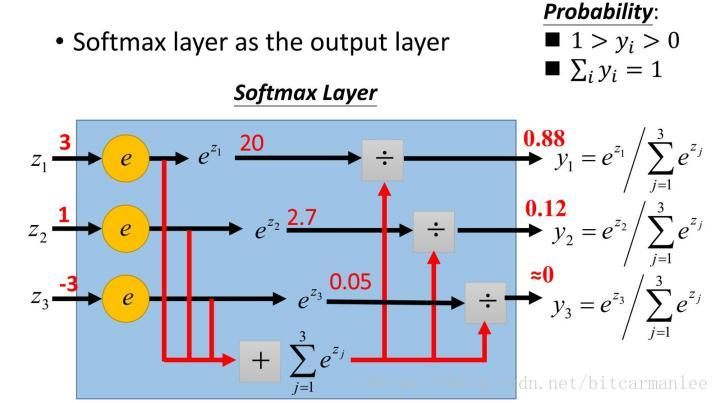
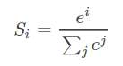

# 转自https://blog.csdn.net/bitcarmanlee/article/details/82320853

## 1.softmax初探
在机器学习尤其是深度学习中，softmax是个非常常用而且比较重要的函数，尤其在多分类的场景中使用广泛。他把一些输入映射为0-1之间的实数，并且归一化保证和为1，因此多分类的概率之和也刚好为1。
首先我们简单来看看softmax是什么意思。顾名思义，softmax由两个单词组成，其中一个是max。对于max我们都很熟悉，比如有两个变量a,b。如果a>b，则max为a，反之为b。用伪码简单描述一下就是 if a > b return a; else b。
另外一个单词为soft。max存在的一个问题是什么呢？如果将max看成一个分类问题，就是非黑即白，最后的输出是一个确定的变量。更多的时候，我们希望输出的是取到某个分类的概率，或者说，我们希望分值大的那一项被经常取到，而分值较小的那一项也有一定的概率偶尔被取到，所以我们就应用到了soft的概念，即最后的输出是每个分类被取到的概率。

## 2.softmax的定义
首先给一个图，这个图比较清晰地告诉大家softmax是怎么计算的。

假设有一个数组V，Vi表示V中的第i个元素，那么这个元素的softmax值为:

该元素的softmax值，就是该元素的指数与所有元素指数和的比值。

这个定义可以说很简单，也很直观。那为什么要定义成这个形式呢？原因主要如下。
  1.softmax设计的初衷，是希望特征对概率的影响是乘性的。
  2.多类分类问题的目标函数常常选为cross-entropy。即
      $L = -\sum\nolimits_{k=1}^nkx$
  其中目标类的tk为1，其余类的tk为0。

在神经网络模型中(最简单的logistic regression也可看成没有隐含层的神经网络)，输出层第i个神经元的输入为ai=∑dwidxdai=∑dwidxd。
神经网络是用error back-propagation训练的，这个过程中有一个关键的量是∂L/∂αi∂L/∂αi。后面我们会进行详细推导。
